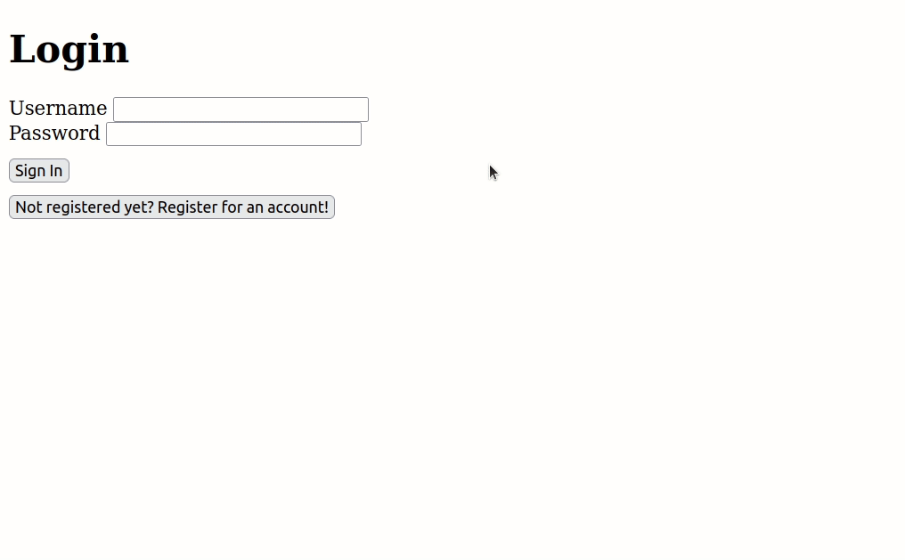

## Updating our Project Part 4 - Rendering the user's albums

Let's now let the user see their list of albums after they log in!

---

## Instructions

---

## Stage 1

1. Go to `App.js` in your **frontend** repo. Import the `Albums` component from the `views` directory, and replace the "successful login" `div` with an instance of the `<Albums />` component.
2. A successful registration or login will now render this component, instead of the "successful login" `div`. 
  >- **Remember**: when a user successfully registers or logs in, the `currentUserId` and `isLoggedIn` state variables in `App.js`, will be updated before `<Albums />` is rendered. This will soon be relevant...
3. You should also pass the `App.js` state variable `currentUserId` to `<Albums />` as a prop.

---

## Stage 2

4. Now go to your **backend** repo. You should create a **new** Express router (serving the "/users" endpoint). 
  >- Create one route in the "users" router, serving `GET` requests. This route will be **dynamic** - the next part of the path will be "/:id/albums" (so the endpoint will be "/users/:id/albums").
  >- You should also create a controller function for the new route. This should find the user in `db,json` whose `id` matches the `/:id` **parameter** in the request you made. 
    >- Can you remember how you can find this parameter using the `req` object?
  >- When the controller function finds the user with the correct `id`, it should make an object containing the `firstName` and `albums` properties for that user and send them back in the `response`, in a JSON format.

---

## Stage 3

5. Now go to `Albums.js` in your **frontend** repo. You should create a `useEffect`, which executes only once, when the component first renders. 
  >- The `useEffect` should make a `fetch` request. This should use the `currentUserId` **prop** (received from `App.js` in Stage 1.3) to send a GET request to `/users/${props.currentUserId}/albums`. As you can see, this request will be sent to our new **dynamic** "/users/:id/albums" route (see Stage 2)! 
  >- When the response is received back from the server, you will receive an object with the `firstName` and `albums` of the user who just registered or logged in.
    >- You should update the `firstName` state variable of `Albums.js` with the user's first name. This should make the `div` with id "greeting" work as expected.
    >- You should update the `albums` state variable of `Albums.js` with the user's current list of albums. This will mean that the user can see a JSX list of their albums.
  >- You can test this by giving a registered user some album objects in `db.json` (in the **backend** repo), and then logging in as that user. Can you see their albums after they log in?
    >- **Note:** You have to add album objects yourself in `db.json` because, due to our changes, the user can no longer use the app to add a new album themselves. That's ok - we can update the app tomorrow to let them do this. :-)

---

### Example:
  
